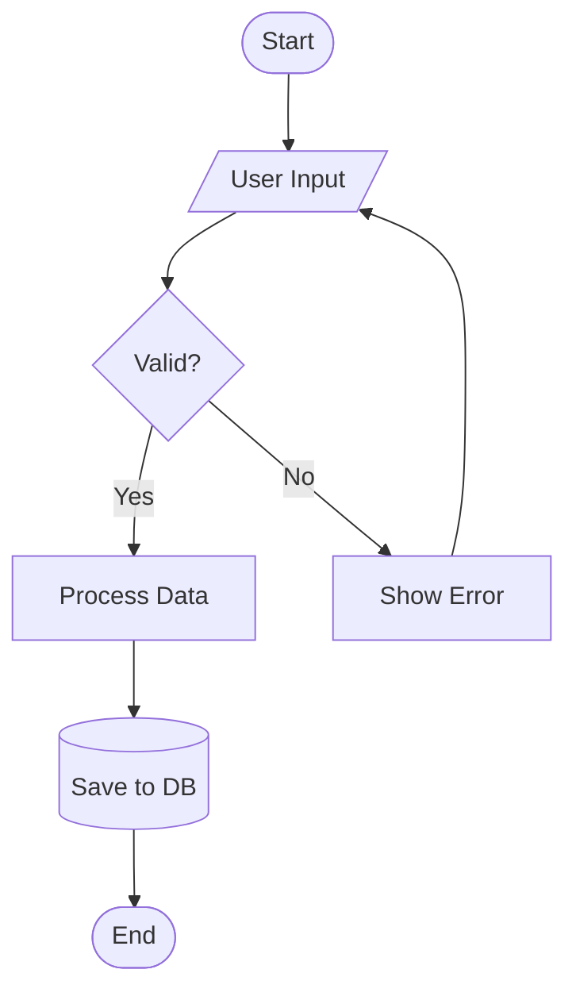

# Mermaid Studio

Expert-level Mermaid diagram creation, validation, and multi-format rendering. Creates diagrams from descriptions or code analysis, validates syntax, and renders to SVG, PNG, or ASCII with professional theming.

## Modes of Operation

This skill operates in three modes based on user intent:

| Mode       | Trigger                                           | What happens               |
| ---------- | ------------------------------------------------- | -------------------------- |
| **Create** | "draw a diagram of...", "visualize my..."         | Generates .mmd code only   |
| **Render** | "render this mermaid", "convert to SVG/PNG/ASCII" | Renders existing .mmd      |
| **Full**   | "create and render...", ambiguous requests        | Create → Validate → Render |

Default to **Full** mode when intent is unclear.

## Step 1: Understand the Request

Before writing any Mermaid code, determine:

1. **What to diagram** — system, flow, schema, architecture, code structure?
2. **Which diagram type** — use the Decision Matrix below
3. **Output format** — code only, SVG, PNG, or ASCII?
4. **Theme preference** — ask only if rendering; default to `default` theme

### Diagram Type Decision Matrix

| User describes...                              | Diagram Type  | Syntax keyword       |
| ---------------------------------------------- | ------------- | -------------------- |
| Process, algorithm, decision tree, workflow    | Flowchart     | `flowchart TD/LR`    |
| API calls, message passing, request/response   | Sequence      | `sequenceDiagram`    |
| Database schema, table relationships           | ERD           | `erDiagram`          |
| OOP classes, domain model, interfaces          | Class         | `classDiagram`       |
| State machine, lifecycle, transitions          | State         | `stateDiagram-v2`    |
| High-level system overview (C4 Level 1)        | C4 Context    | `C4Context`          |
| Applications, databases, services (C4 Level 2) | C4 Container  | `C4Container`        |
| Internal components (C4 Level 3)               | C4 Component  | `C4Component`        |
| Request flows with numbered steps              | C4 Dynamic    | `C4Dynamic`          |
| Infrastructure, cloud deployment               | C4 Deployment | `C4Deployment`       |
| Cloud services with icons (AWS/GCP/Azure)      | Architecture  | `architecture-beta`  |
| Project timeline, scheduling                   | Gantt         | `gantt`              |
| Proportional data, percentages                 | Pie           | `pie`                |
| Brainstorming, hierarchical ideas              | Mindmap       | `mindmap`            |
| Historical events, chronology                  | Timeline      | `timeline`           |
| Branching strategy, git history                | Git Graph     | `gitGraph`           |
| Flow quantities, resource distribution         | Sankey        | `sankey-beta`        |
| X/Y data visualization                         | XY Chart      | `xychart-beta`       |
| Priority matrix, strategic positioning         | Quadrant      | `quadrantChart`      |
| Layout control, grid positioning               | Block         | `block-beta`         |
| Network packets, protocol headers              | Packet        | `packet-beta`        |
| Task boards, kanban workflow                   | Kanban        | `kanban`             |
| User experience, satisfaction scoring          | User Journey  | `journey`            |
| System requirements traceability               | Requirement   | `requirementDiagram` |

If the user's description doesn't clearly map to one type, suggest 2-3 options with a brief rationale for each, then let them choose.

### When to Load References

Load reference files ONLY when needed for the specific diagram type:

- **C4 diagrams** → Read `references/c4-architecture.md` BEFORE writing code
- **AWS/Cloud architecture** → Read `references/aws-architecture.md` BEFORE writing code
- **Code-to-diagram** → Read `references/code-to-diagram.md` BEFORE analyzing
- **Theming/styling** → Read `references/themes.md` when user requests custom themes
- **Syntax errors** → Read `references/troubleshooting.md` when validation fails
- **Any diagram type details** → Read `references/diagram-types.md` for comprehensive syntax

## Step 2: Create the Diagram

### 2.1 — Write Mermaid Code

Follow these principles in order of priority:

1. **Correctness first** — valid syntax that renders without errors
2. **Clarity** — meaningful labels, logical flow direction, clear relationships
3. **Simplicity** — under 20 nodes per diagram; split complex systems into multiple
4. **Consistency** — uniform naming (camelCase for IDs, descriptive labels in brackets)

### 2.2 — Structure Rules

```
%% Always include a descriptive comment at the top
%% Diagram: [Purpose] | Author: [auto] | Date: [auto]
[diagramType]
    [content]
```

**Naming conventions:**

- Node IDs: camelCase, descriptive (`orderService`, not `s1`)
- Labels: natural language in brackets (`[Order Service]`)
- Relationships: action verbs (`"Sends order to"`, `"Reads from"`)

**Layout best practices:**

- `TD` (top-down) for hierarchical flows and processes
- `LR` (left-right) for timelines and sequential processes
- `RL` for right-to-left reading contexts
- Use `subgraph` to group related nodes; name subgraphs meaningfully
- Add `direction` inside subgraphs when needed for different flow

### 2.3 — Quick Reference Examples

**Flowchart:**



**Sequence:**


**ERD:**


**C4 Context:**


**Architecture (AWS):**


For comprehensive syntax of ALL diagram types, read `references/diagram-types.md`.

## Step 3: Validate

Before rendering, ALWAYS validate the Mermaid syntax:

```bash
node $SKILL_DIR/scripts/validate.mjs <file.mmd>
```

If validation fails:

1. Read the error message carefully
2. Consult `references/troubleshooting.md` for common fixes
3. Fix the syntax and re-validate
4. Maximum 3 fix attempts before asking the user for clarification

## Step 4: Render

### 4.1 — Setup (First Run Only)

```bash
bash $SKILL_DIR/scripts/setup.sh
```

This auto-installs both rendering engines. Run once per environment.

### 4.2 — Single Diagram Rendering

**SVG (default — best quality):**

```bash
node $SKILL_DIR/scripts/render.mjs \
  --input diagram.mmd \
  --output diagram.svg \
  --format svg \
  --theme default
```

**PNG (for documents and presentations):**

```bash
node $SKILL_DIR/scripts/render.mjs \
  --input diagram.mmd \
  --output diagram.png \
  --format png \
  --theme default \
  --width 1200
```

**ASCII (for terminals and READMEs):**

```bash
node $SKILL_DIR/scripts/render-ascii.mjs \
  --input diagram.mmd
```

### 4.3 — Batch Rendering

For multiple diagrams at once:

```bash
node $SKILL_DIR/scripts/batch.mjs \
  --input-dir ./diagrams \
  --output-dir ./rendered \
  --format svg \
  --theme default \
  --workers 4
```

### 4.4 — Available Themes

**beautiful-mermaid themes (15):**
`tokyo-night` | `tokyo-night-storm` | `tokyo-night-light` | `dracula` | `nord` | `nord-light` | `catppuccin-mocha` | `catppuccin-latte` | `github-dark` | `github-light` | `solarized-dark` | `solarized-light` | `one-dark` | `zinc-dark` | `zinc-light`

**mermaid-cli native themes (5):**
`default` | `forest` | `dark` | `neutral` | `base`

**Custom theme (via mermaid-cli):**

```bash
node $SKILL_DIR/scripts/render.mjs \
  --input diagram.mmd \
  --output diagram.svg \
  --format svg \
  --theme base \
  --config '{"theme":"base","themeVariables":{"primaryColor":"#ff6b6b","secondaryColor":"#4ecdc4"}}'
```

For the full theme catalog with previews, read `references/themes.md`.

### 4.5 — Render Engine Selection

The render script uses dual-engine fallback:

1. **Primary: @mermaid-js/mermaid-cli** — most stable, supports ALL diagram types, PNG/SVG/PDF output, custom configs
2. **Fallback: beautiful-mermaid** — better visual themes, SVG + ASCII output, supports flowchart/sequence/state/class/ER

If the primary engine fails, the script automatically tries the fallback. ASCII rendering always uses beautiful-mermaid exclusively.

## Step 5: Code-to-Diagram (When Requested)

When the user asks to visualize existing code or architecture:

1. Read `references/code-to-diagram.md` for the analysis methodology
2. Analyze the codebase to identify the right diagram type:
   - Module dependencies → Flowchart or Class diagram
   - API routes and handlers → Sequence diagram
   - Database models/schemas → ERD
   - Service architecture → C4 Container or Architecture diagram
   - State machines in code → State diagram
3. Generate the .mmd file
4. Validate and render as usual

## Common Patterns

### Error Handling Flow


### Microservice Communication


### Authentication State Machine


## Troubleshooting Quick Reference

| Symptom              | Likely Cause    | Fix                                                 |
| -------------------- | --------------- | --------------------------------------------------- |
| Diagram won't render | Syntax error    | Run validate.mjs, check brackets/quotes             |
| Labels cut off       | Text too long   | Shorten labels or use line breaks `<br/>`           |
| Layout looks wrong   | Wrong direction | Try different TD/LR/BT/RL                           |
| Nodes overlap        | Too many nodes  | Split into subgraphs or multiple diagrams           |
| `mmdc` not found     | Not installed   | Run `setup.sh`                                      |
| Theme not applied    | Wrong engine    | beautiful-mermaid themes only work with that engine |

For comprehensive troubleshooting, read `references/troubleshooting.md`.

## Output Conventions

- Save .mmd source files alongside rendered outputs
- Naming: `{purpose}-{type}.mmd` (e.g., `auth-flow-sequence.mmd`)
- For batch: maintain input filename, change extension
- Always provide both the .mmd source and rendered file to the user
