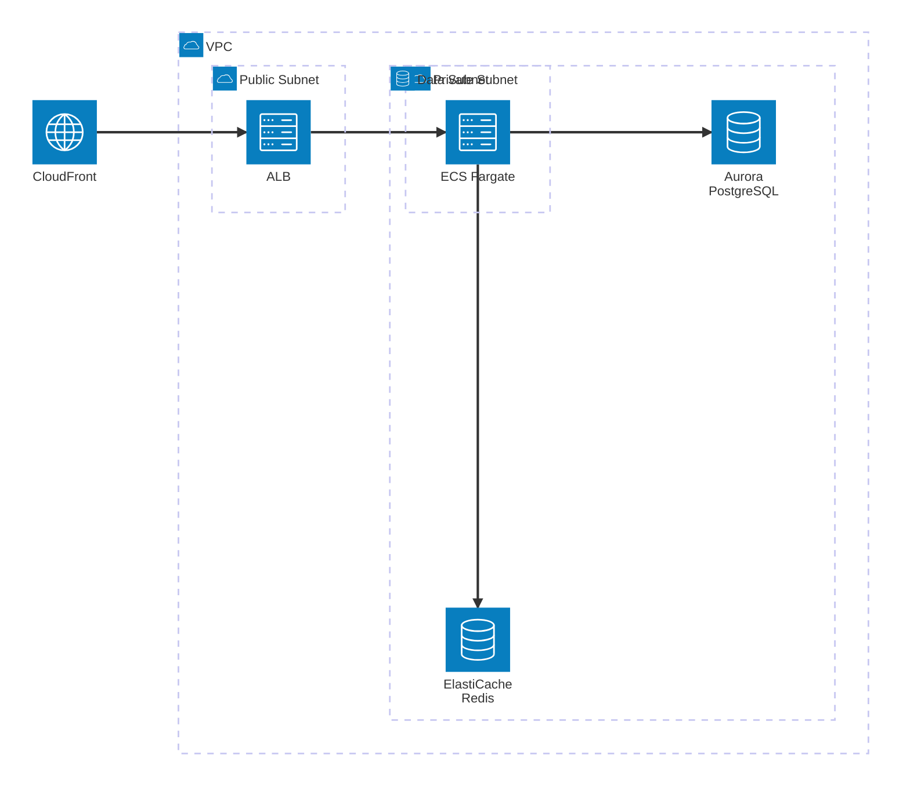
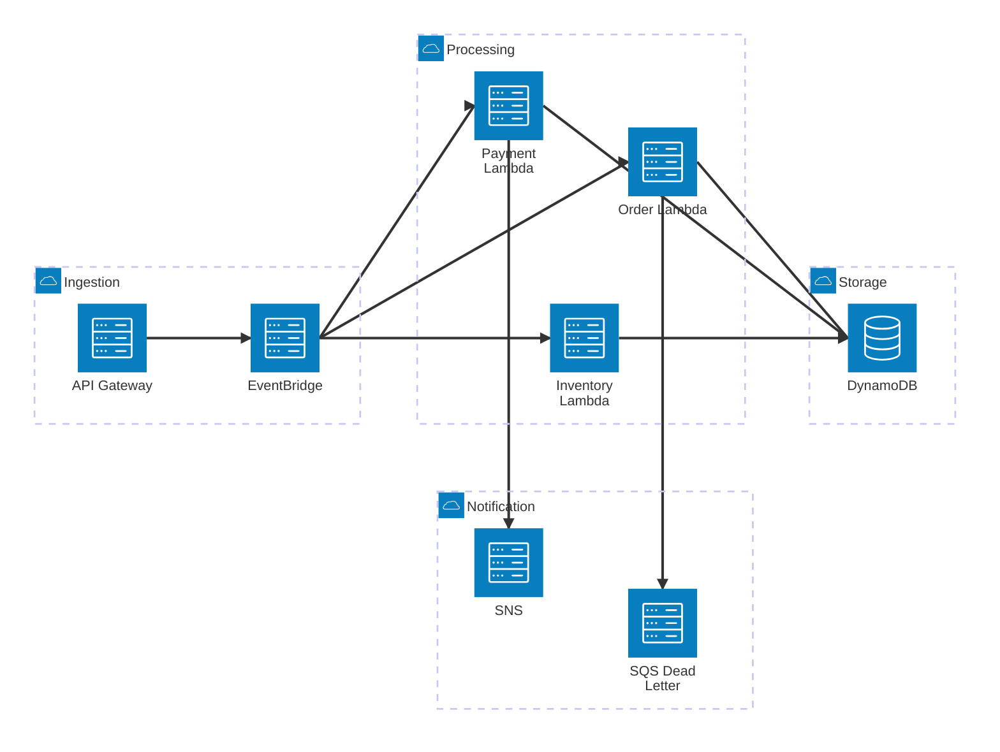
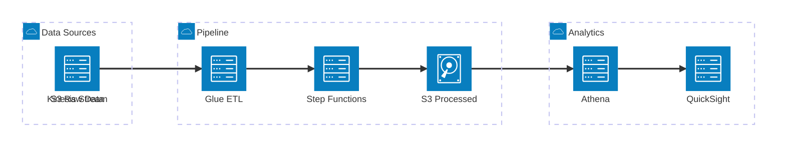
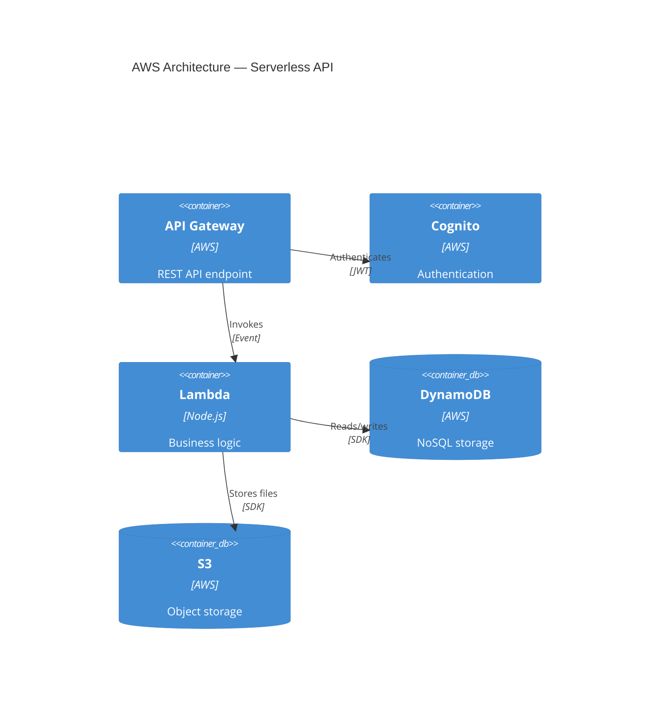
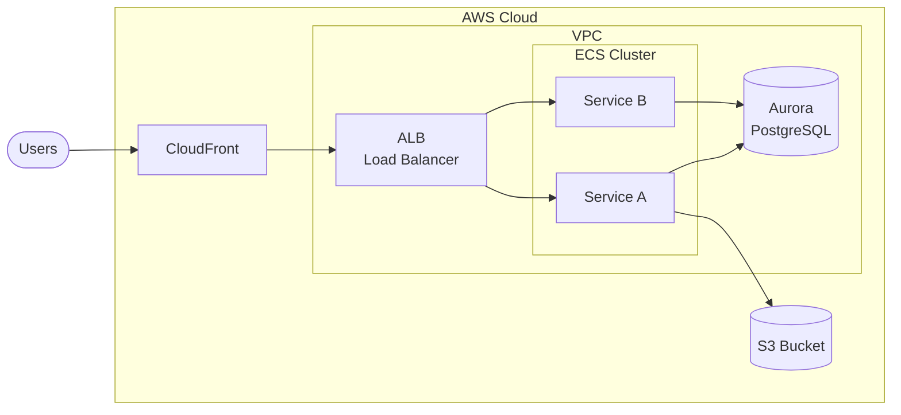

# AWS Architecture Diagrams — Complete Reference

Load this file when the user requests cloud architecture diagrams, AWS infrastructure visualization, or `architecture-beta` diagrams.

## Overview

Mermaid's `architecture-beta` diagram type enables cloud architecture visualization with icons representing services. Combined with custom icon packs (like AWS), it produces professional infrastructure diagrams.

**Important:** `architecture-beta` requires Mermaid v11+. Some markdown renderers (GitHub, GitLab) may not render these yet. For universal compatibility, consider using C4 diagrams with descriptive labels instead.

## Basic Syntax

```mermaid
architecture-beta

    group groupId(icon)[Label]

    service serviceId(icon)[Label] in groupId

    serviceA:R --> L:serviceB
```

### Building Blocks

| Element          | Syntax                               | Purpose                                |
| ---------------- | ------------------------------------ | -------------------------------------- |
| Group            | `group id(icon)[Label]`              | Visual boundary (VPC, region, account) |
| Service          | `service id(icon)[Label]`            | Individual service node                |
| Service in group | `service id(icon)[Label] in groupId` | Service inside a group                 |
| Edge             | `serviceA:Side --> Side:serviceB`    | Connection with direction              |

### Edge Sides

Edges connect from/to specific sides of services:

- `L` — Left
- `R` — Right
- `T` — Top
- `B` — Bottom

```
api:R --> L:lambda        %% api's right connects to lambda's left
lambda:B --> T:db          %% lambda's bottom connects to db's top
```

### Built-in Icons

Available without any icon pack:
`cloud`, `database`, `disk`, `internet`, `server`

## Icon Packs

### Using Iconify Icons

Mermaid supports 200,000+ icons from iconify.design. Common technology icons:

```
%% Format: iconPack:icon-name
service node(logos:nodejs-icon)[Node.js]
service react(logos:react)[React]
service docker(logos:docker-icon)[Docker]
service k8s(logos:kubernetes)[Kubernetes]
service postgres(logos:postgresql)[PostgreSQL]
service redis(logos:redis)[Redis]
service nginx(logos:nginx)[Nginx]
service graphql(logos:graphql)[GraphQL]
```

**Note:** Iconify icons require the icon pack to be registered in the rendering environment. They do NOT work in static markdown renderers.

### AWS Icon Pack

The `aws-mermaid-icons` project provides 855+ AWS service icons in iconifyJSON format. Two variants exist:

1. **Standard** — transparent backgrounds, colored glyphs
2. **Background** — colored tiles, white glyphs (classic AWS style)

**Registration (in rendering code):**

```javascript
import mermaid from 'mermaid'

mermaid.registerIconPacks([
  {
    name: 'aws',
    loader: () =>
      fetch('https://raw.githubusercontent.com/harmalh/aws-mermaid-icons/main/iconify-json/aws-icons.json').then(
        (res) => res.json(),
      ),
  },
])
```

**AWS icon naming conventions:**

- AWS services: `aws:aws-{service}` (e.g., `aws:aws-lambda`, `aws:aws-glue`)
- Amazon services: `aws:amazon-{service}` (e.g., `aws:amazon-rds`, `aws:amazon-s3`)
- Resources: `aws:{resource}` (e.g., `aws:amazon-eventbridge-topic`)

### Common AWS Service Icons

| Service         | Icon name                                | Category       |
| --------------- | ---------------------------------------- | -------------- |
| Lambda          | `aws:aws-lambda`                         | Compute        |
| EC2             | `aws:aws-ec2`                            | Compute        |
| ECS             | `aws:amazon-ecs`                         | Compute        |
| Fargate         | `aws:aws-fargate`                        | Compute        |
| S3              | `aws:amazon-simple-storage-service`      | Storage        |
| EBS             | `aws:amazon-elastic-block-store`         | Storage        |
| EFS             | `aws:amazon-efs`                         | Storage        |
| RDS             | `aws:amazon-rds`                         | Database       |
| DynamoDB        | `aws:amazon-dynamodb`                    | Database       |
| ElastiCache     | `aws:amazon-elasticache`                 | Database       |
| Aurora          | `aws:amazon-aurora`                      | Database       |
| API Gateway     | `aws:amazon-api-gateway`                 | Networking     |
| CloudFront      | `aws:amazon-cloudfront`                  | Networking     |
| Route 53        | `aws:amazon-route-53`                    | Networking     |
| ELB/ALB         | `aws:elastic-load-balancing`             | Networking     |
| VPC             | `aws:amazon-virtual-private-cloud`       | Networking     |
| SQS             | `aws:amazon-sqs`                         | Messaging      |
| SNS             | `aws:amazon-sns`                         | Messaging      |
| EventBridge     | `aws:amazon-eventbridge`                 | Messaging      |
| Kinesis         | `aws:amazon-kinesis`                     | Messaging      |
| Step Functions  | `aws:aws-step-functions`                 | Integration    |
| CloudWatch      | `aws:amazon-cloudwatch`                  | Monitoring     |
| X-Ray           | `aws:aws-x-ray`                          | Monitoring     |
| IAM             | `aws:aws-identity-and-access-management` | Security       |
| Cognito         | `aws:amazon-cognito`                     | Security       |
| KMS             | `aws:aws-key-management-service`         | Security       |
| WAF             | `aws:aws-waf`                            | Security       |
| CodePipeline    | `aws:aws-codepipeline`                   | DevOps         |
| CodeBuild       | `aws:aws-codebuild`                      | DevOps         |
| CodeDeploy      | `aws:aws-codedeploy`                     | DevOps         |
| ECR             | `aws:amazon-elastic-container-registry`  | Containers     |
| SageMaker       | `aws:amazon-sagemaker`                   | ML/AI          |
| Bedrock         | `aws:amazon-bedrock`                     | ML/AI          |
| CloudFormation  | `aws:aws-cloudformation`                 | Infrastructure |
| Secrets Manager | `aws:aws-secrets-manager`                | Security       |
| Parameter Store | `aws:aws-systems-manager`                | Management     |

## Architecture Patterns

### Pattern 1: Three-Tier Web Application



### Pattern 2: Serverless API


### Pattern 3: Event-Driven Microservices



### Pattern 4: Data Pipeline



### Pattern 5: CI/CD Pipeline


## Fallback Strategy

When `architecture-beta` is not supported by the rendering environment, use these alternatives:

### Option A: C4 Container Diagram (Best Alternative)

C4 diagrams work everywhere and convey the same information:



### Option B: Flowchart with AWS Labels



## Best Practices

1. **Group by boundary** — VPC, subnet, region, account
2. **Left-to-right flow** — request path should read naturally
3. **Label connections** — protocol and purpose
4. **One diagram per concern** — networking, compute, data, separately
5. **Include external systems** — show what connects from outside
6. **Security boundaries** — show public vs private subnets
7. **Use built-in icons as fallback** — `cloud`, `database`, `disk`, `server`, `internet` work everywhere without icon packs
