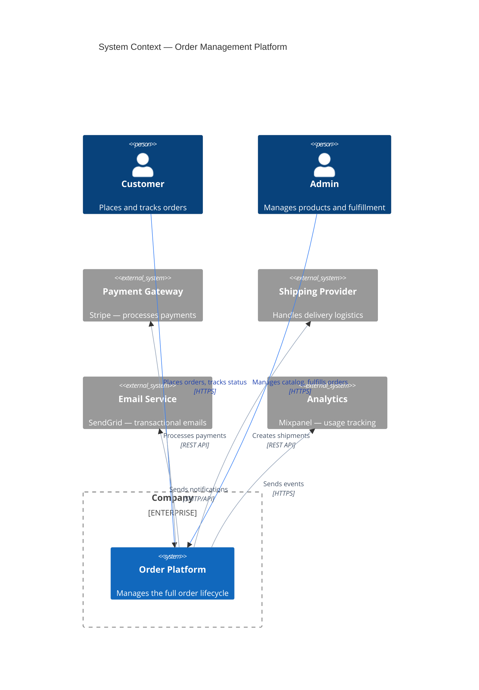
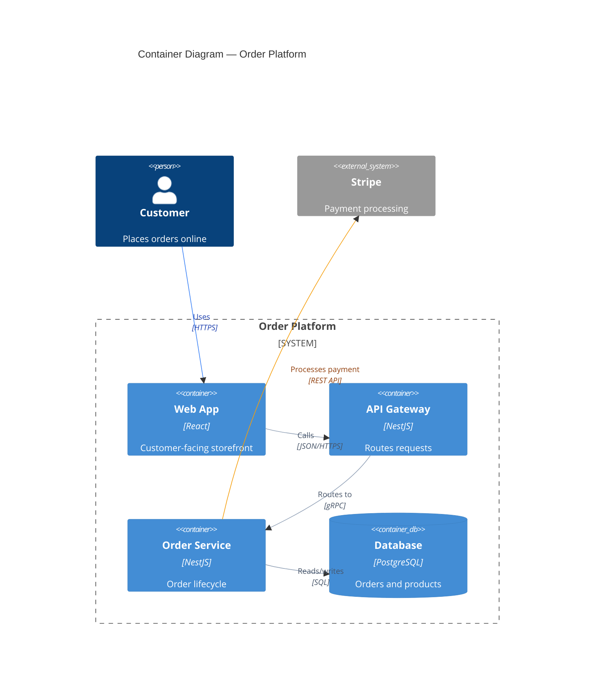
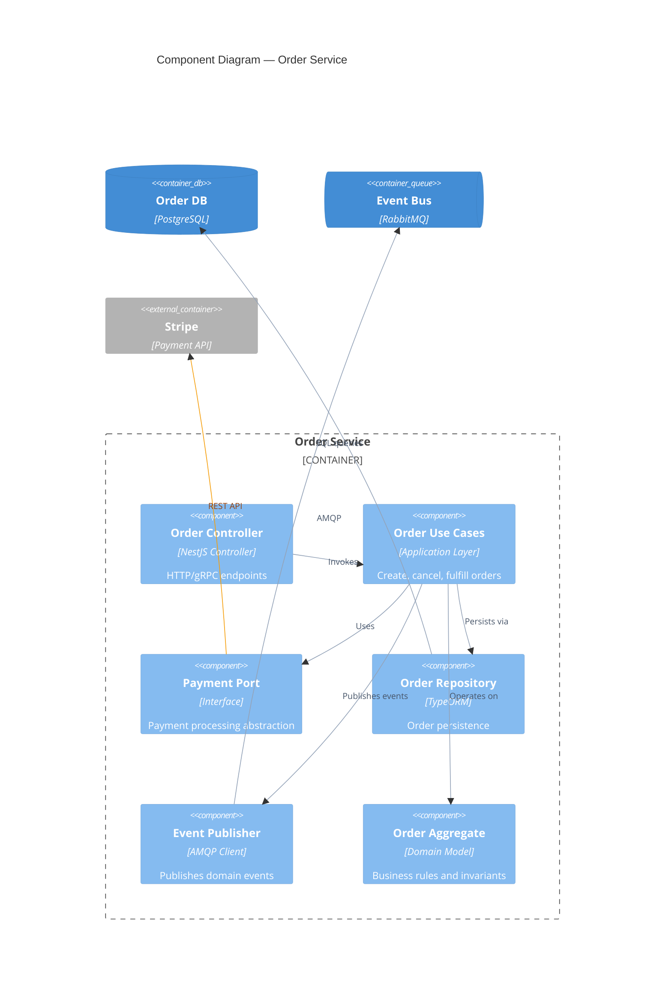
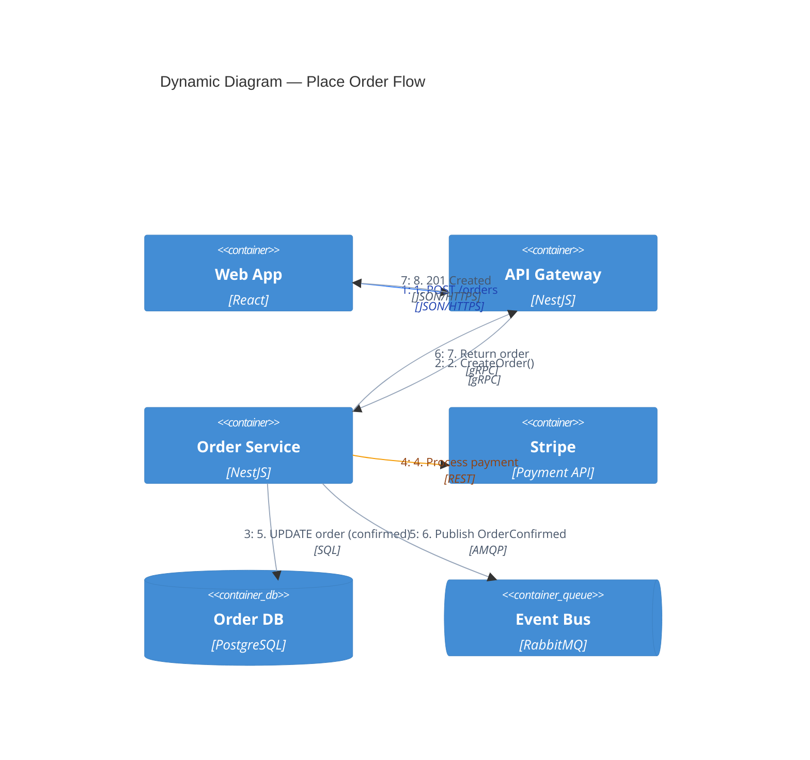
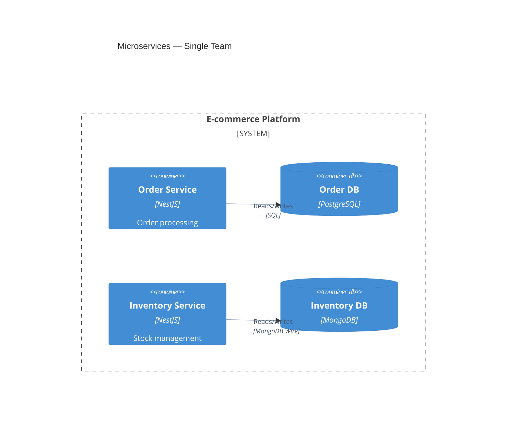
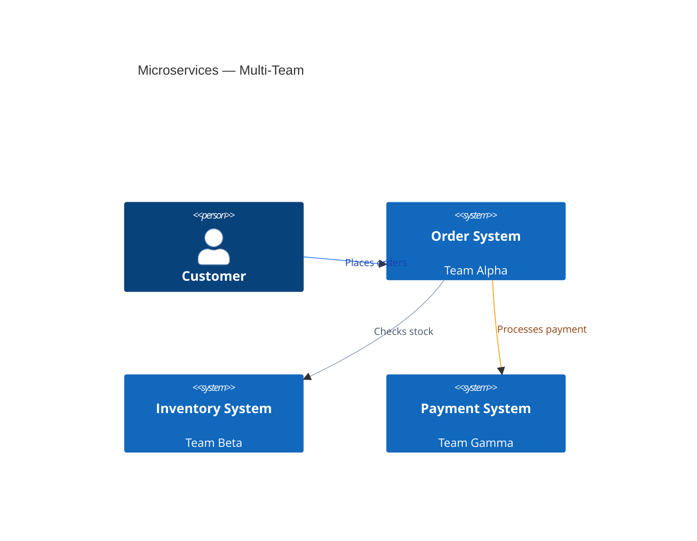
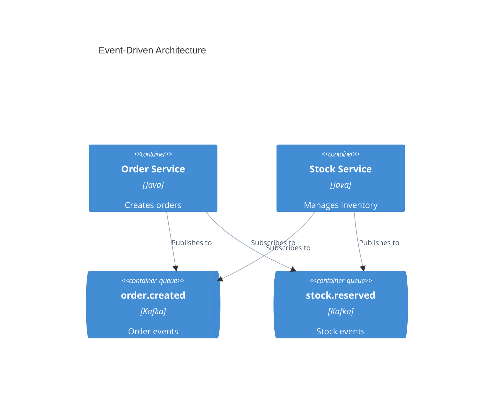

# C4 Architecture Diagrams — Complete Reference

Load this file when the user requests C4 diagrams or system architecture documentation. The C4 model provides four levels of abstraction.

## CRITICAL: Mandatory Rules

**Every C4 diagram MUST follow these rules.** Without them, Mermaid renders harsh black lines that overlap elements and make the diagram unreadable.

1. **Max 6 `Rel()` per diagram.** More relationships cause Dagre to route arrows through nodes, creating unreadable spaghetti. Split complex systems into multiple focused diagrams.
2. **Always style all relationships.** Apply `UpdateRelStyle` to every `Rel()` with soft line colors (see template below).
3. **Max 6-8 elements per diagram.** Tree-shaped topology (1 in, 1-2 out per node) renders best. Avoid mesh connections.
4. **Do NOT set `fontFamily`.** Mermaid's default font works everywhere. Setting `system-ui` or `Segoe UI` will render as Times New Roman in headless Chromium.

### Template: Add This to Every C4 Diagram

```
    %% === MANDATORY: Apply to ALL Rel() references ===
    UpdateRelStyle(fromAlias, toAlias, $textColor="#475569", $lineColor="#94a3b8")
    %% Repeat for each relationship in the diagram

    %% === MANDATORY: Layout optimization ===
    UpdateLayoutConfig($c4ShapeInRow="3", $c4BoundaryInRow="1")
```

### When Labels Overlap Elements

Add `$offsetX` and `$offsetY` to push labels away from elements:

```
    UpdateRelStyle(from, to, $textColor="#475569", $lineColor="#94a3b8", $offsetY="-10")
    UpdateRelStyle(from, to, $textColor="#475569", $lineColor="#94a3b8", $offsetX="-40", $offsetY="20")
```

### Highlighting Important Relationships

Use accent colors for critical paths while keeping other lines soft:

```
    %% Primary relationship — emphasized
    UpdateRelStyle(client, api, $textColor="#1e40af", $lineColor="#3b82f6")

    %% Secondary relationships — soft
    UpdateRelStyle(api, db, $textColor="#475569", $lineColor="#94a3b8")

    %% External/risky connection — warning
    UpdateRelStyle(api, extPayment, $textColor="#92400e", $lineColor="#f59e0b")
```

## C4 Levels — When to Use Each

| Level | Diagram      | Audience       | Purpose                               |
| ----- | ------------ | -------------- | ------------------------------------- |
| 1     | C4Context    | Everyone       | System boundaries and external actors |
| 2     | C4Container  | Technical team | Applications, databases, services     |
| 3     | C4Component  | Developers     | Internal module structure             |
| 4     | C4Deployment | DevOps/SRE     | Infrastructure and deployment nodes   |
| —     | C4Dynamic    | Technical team | Numbered request flows                |

**Rule of thumb:** Context + Container diagrams are sufficient for most teams. Only create Component/Code diagrams when they genuinely add clarity.

### Audience-Appropriate Recommendations

- **Executives/PMs:** Context only
- **Architects:** Context + Container
- **Developers:** Context + Container + Components for their area
- **DevOps/SRE:** Container + Deployment

## Element Syntax

### People and Systems

```
Person(alias, "Label", "Description")
Person_Ext(alias, "Label", "Description")
System(alias, "Label", "Description")
System_Ext(alias, "Label", "Description")
SystemDb(alias, "Label", "Description")
SystemDb_Ext(alias, "Label", "Description")
SystemQueue(alias, "Label", "Description")
SystemQueue_Ext(alias, "Label", "Description")
```

### Containers

```
Container(alias, "Label", "Technology", "Description")
Container_Ext(alias, "Label", "Technology", "Description")
ContainerDb(alias, "Label", "Technology", "Description")
ContainerDb_Ext(alias, "Label", "Technology", "Description")
ContainerQueue(alias, "Label", "Technology", "Description")
ContainerQueue_Ext(alias, "Label", "Technology", "Description")
```

### Components

```
Component(alias, "Label", "Technology", "Description")
Component_Ext(alias, "Label", "Technology", "Description")
ComponentDb(alias, "Label", "Technology", "Description")
ComponentQueue(alias, "Label", "Technology", "Description")
```

### Boundaries

```
Enterprise_Boundary(alias, "Label") { ... }
System_Boundary(alias, "Label") { ... }
Container_Boundary(alias, "Label") { ... }
Boundary(alias, "Label", "type") { ... }
```

### Relationships

```
Rel(from, to, "Label")
Rel(from, to, "Label", "Technology")
BiRel(from, to, "Label")
Rel_U(from, to, "Label")       %% Upward
Rel_D(from, to, "Label")       %% Downward
Rel_L(from, to, "Label")       %% Leftward
Rel_R(from, to, "Label")       %% Rightward
Rel_Back(from, to, "Label")    %% Back relationship
```

**Layout control tip:** When auto-layout causes lines to overlap, use directional variants (`Rel_D`, `Rel_R`, etc.) to force arrows in a specific direction. This is the most effective way to avoid overlapping lines.

### Deployment Nodes

```
Deployment_Node(alias, "Label", "Type") { ... }
Deployment_Node(alias, "Label", "Type", "Description") { ... }
Node(alias, "Label") { ... }
Node_L(alias, "Label") { ... }
Node_R(alias, "Label") { ... }
```

## Complete Examples (All With Mandatory Styling)

### Level 1 — System Context



### Level 2 — Container

**Keep container diagrams focused: max 6-8 elements and 6 Rel().** For complex systems, split into multiple diagrams (one per bounded context or service area).



### Level 3 — Component (Order Service)



### C4 Dynamic — Request Flow



### C4 Deployment

```mermaid
C4Deployment
    title Deployment — Production Environment

    Deployment_Node(cdn, "CloudFront", "CDN") {
        Container(static, "Static Assets", "React Build", "JS/CSS/HTML")
    }

    Deployment_Node(aws, "AWS", "us-east-1") {
        Deployment_Node(ecs, "ECS Cluster", "Fargate") {
            Deployment_Node(apiTask, "API Task", "2 vCPU, 4GB") {
                Container(api, "API Gateway", "NestJS")
            }
            Deployment_Node(orderTask, "Order Task", "2 vCPU, 4GB") {
                Container(orderSvc, "Order Service", "NestJS")
            }
        }

        Deployment_Node(rds, "RDS", "db.r6g.xlarge") {
            ContainerDb(db, "Order DB", "PostgreSQL 16")
        }

        Deployment_Node(elasticache, "ElastiCache", "r6g.large") {
            ContainerDb(cache, "Cache", "Redis 7")
        }

        Deployment_Node(mq, "Amazon MQ", "mq.m5.large") {
            ContainerQueue(bus, "Event Bus", "RabbitMQ")
        }
    }

    Rel(cdn, api, "Routes API calls", "HTTPS")
    Rel(api, orderSvc, "Internal", "gRPC")
    Rel(orderSvc, db, "Reads/writes", "SQL/TLS")
    Rel(api, cache, "Caches", "Redis/TLS")
    Rel(orderSvc, bus, "Publishes", "AMQP/TLS")

    UpdateRelStyle(cdn, api, $textColor="#1e40af", $lineColor="#3b82f6")
    UpdateRelStyle(api, orderSvc, $textColor="#475569", $lineColor="#94a3b8")
    UpdateRelStyle(orderSvc, db, $textColor="#475569", $lineColor="#94a3b8")
    UpdateRelStyle(api, cache, $textColor="#475569", $lineColor="#94a3b8")
    UpdateRelStyle(orderSvc, bus, $textColor="#475569", $lineColor="#94a3b8")

    UpdateLayoutConfig($c4ShapeInRow="3", $c4BoundaryInRow="1")
```

## Styling and Layout

### Layout Configuration

```
UpdateLayoutConfig($c4ShapeInRow="3", $c4BoundaryInRow="1")
```

### Element Styling

```
UpdateElementStyle(alias, $fontColor="red", $bgColor="grey", $borderColor="red")
```

### Relationship Styling

Use `$offsetX` and `$offsetY` to fix overlapping labels:

```
UpdateRelStyle(from, to, $textColor="#475569", $lineColor="#94a3b8", $offsetY="-10")
```

### Professional Color Palette for Custom Element Styles

| Purpose              | bgColor   | fontColor | borderColor | When to use                     |
| -------------------- | --------- | --------- | ----------- | ------------------------------- |
| Primary emphasis     | `#4f46e5` | `#ffffff` | `#3730a3`   | Core systems, main service      |
| Success / Data store | `#059669` | `#ffffff` | `#047857`   | Databases, completed states     |
| Warning / External   | `#d97706` | `#ffffff` | `#b45309`   | External systems, risky paths   |
| Error / Critical     | `#dc2626` | `#ffffff` | `#b91c1c`   | Error states ONLY               |
| Neutral / Secondary  | `#64748b` | `#ffffff` | `#475569`   | Supporting services, background |
| Info / Highlight     | `#0284c7` | `#ffffff` | `#0369a1`   | Informational annotations       |

## Microservices Patterns

### Single-Team Ownership

When one team owns all services, model each as a **container**:



### Multi-Team Ownership

When separate teams own services, promote them to **systems**:



### Event-Driven Architecture

Show individual topics/queues as containers — NOT a single "Kafka" box:



## Essential Rules

1. **Every element must have:** Name, Type, Technology (where applicable), Description
2. **Use unidirectional arrows** — bidirectional creates ambiguity
3. **Label arrows with action verbs** — "Sends email using", not just "uses"
4. **Include technology labels** — "JSON/HTTPS", "SQL", "gRPC"
5. **Under 15 elements per diagram** — split if more (elegance > completeness)
6. **Always include a title**
7. **Meaningful aliases** — `orderService` not `s1`
8. **ALWAYS add UpdateRelStyle** — soft line colors are mandatory
9. **ALWAYS add UpdateLayoutConfig** — prevents element crowding

## Common Mistakes

| Mistake                  | Why it's wrong                  | Fix                                  |
| ------------------------ | ------------------------------- | ------------------------------------ |
| Shared lib as Container  | Containers are deployable units | Model as Component                   |
| Single "Kafka" container | Hides topic structure           | Show individual topics               |
| "Subcomponents" level    | Not a C4 concept                | Use Component or Class               |
| Removing type labels     | Loses information               | Always show type/tech                |
| Bidirectional arrows     | Ambiguous flow direction        | Use unidirectional                   |
| No technology labels     | Can't assess architecture       | Add protocol/tech                    |
| No UpdateRelStyle        | Harsh black lines               | Add soft colors to ALL relationships |
| No UpdateLayoutConfig    | Elements crowd together         | Add layout config at end             |
| No offset on overlap     | Labels hidden behind elements   | Add $offsetX/$offsetY to fix         |

## File Naming Convention

```
docs/architecture/
├── c4-context.md
├── c4-containers.md
├── c4-components-{feature}.md
├── c4-deployment.md
└── c4-dynamic-{flow}.md
```
