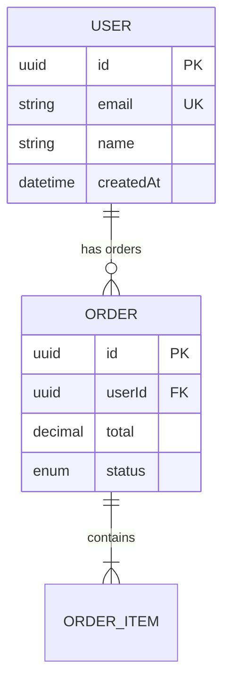

# Code-to-Diagram — Analysis Methodology

Load this file when the user asks to visualize existing code, analyze a codebase, or generate diagrams from source files.

## Workflow

1. **Identify scope** — what part of the code to diagram
2. **Choose analysis strategy** — which patterns to look for
3. **Extract structure** — read relevant files
4. **Select diagram type** — based on what was found
5. **Generate diagram** — create .mmd file
6. **Validate and render** — as usual

## Analysis Strategies by Request Type

### "Show me the architecture"

**What to look for:**

- Project root structure (folders, entry points)
- Package.json / pyproject.toml / Cargo.toml for dependencies
- Docker files, docker-compose.yml for services
- Infrastructure-as-code (CDK, Terraform, CloudFormation, Pulumi)
- Environment variables for external service connections

**Recommended diagram:** C4 Container or Architecture (for cloud infra)

**File exploration order:**

1. Root directory listing
2. docker-compose.yml / Dockerfile
3. Infrastructure files (cdk/, terraform/, cloudformation/)
4. Main entry point (src/main.ts, app.py, cmd/main.go)
5. Config files for external connections

### "Diagram the database schema"

**What to look for:**

- ORM models/entities (TypeORM, Prisma, SQLAlchemy, Drizzle)
- Migration files
- Schema definition files (.prisma, models.py, entities/)
- Foreign key references
- Enum definitions

**Recommended diagram:** ERD

**File exploration order:**

1. Schema files (schema.prisma, models/, entities/)
2. Migration files (for relationship confirmation)
3. Seed files (for understanding data relationships)

**Extraction rules:**

- Each model/entity → ERD entity
- Each field → attribute with type
- `@relation` / ForeignKey → relationship
- `@id` / primary_key → PK marker
- `@unique` → UK marker
- Foreign key fields → FK marker

**Example — Prisma to ERD:**

```prisma
// Input: schema.prisma
model User {
  id        String   @id @default(uuid())
  email     String   @unique
  name      String
  orders    Order[]
  createdAt DateTime @default(now())
}

model Order {
  id        String      @id @default(uuid())
  userId    String
  user      User        @relation(fields: [userId], references: [id])
  items     OrderItem[]
  total     Decimal
  status    OrderStatus
}
```



### "Show me the API flow"

**What to look for:**

- Route definitions (controllers, routers, handlers)
- Middleware chain
- Service layer calls
- External API calls
- Database queries in the flow

**Recommended diagram:** Sequence diagram

**File exploration order:**

1. Route/controller files
2. Middleware definitions
3. Service files called by controllers
4. Repository/data-access files

**Extraction rules:**

- Each controller/handler → participant
- Each service class → participant
- Each external call → external participant
- Method calls → synchronous messages (->>)
- Returns → response messages (-->>)
- If/else in code → alt blocks
- Try/catch → opt or break blocks
- Loops → loop blocks

### "Show me the module dependencies"

**What to look for:**

- Import statements between modules
- Module registration (NestJS modules, Angular modules)
- Dependency injection configuration
- Package/module boundaries

**Recommended diagram:** Class diagram or Flowchart

**Extraction rules:**

- Each module/package → class or node
- Import/dependency → arrow
- Circular dependencies → highlight (bidirectional or color)

### "Show me the state machine"

**What to look for:**

- Enum definitions for states/status
- Switch/case or if/else chains on status
- State machine libraries (XState, statechart)
- Transition functions
- Event handlers that change state

**Recommended diagram:** State diagram

**Extraction rules:**

- Each enum value → state
- Each transition function → edge with event label
- Initial state → [*] --> state
- Terminal states → state --> [*]
- Guard conditions → edge labels

### "Show me the class structure"

**What to look for:**

- Class definitions with methods and properties
- Interfaces and abstract classes
- Inheritance (extends)
- Composition (has-a fields)
- Implementation (implements)

**Recommended diagram:** Class diagram

**Extraction rules:**

- `class X extends Y` → inheritance (`Y <|-- X`)
- `class X implements Y` → realization (`Y ..|> X`)
- Field of type `Y` in class `X` → association (`X --> Y`)
- Array/collection of `Y` in `X` → aggregation (`X o-- Y`)
- `Y` created and owned by `X` → composition (`X *-- Y`)
- `public` → `+`, `private` → `-`, `protected` → `#`

## Framework-Specific Patterns

### NestJS

```
src/
├── modules/
│   ├── user/
│   │   ├── user.module.ts       → Module boundary
│   │   ├── user.controller.ts   → API endpoints (sequence participant)
│   │   ├── user.service.ts      → Business logic (sequence participant)
│   │   ├── user.repository.ts   → Data access (sequence participant)
│   │   ├── user.entity.ts       → Database model (ERD entity)
│   │   └── dto/                 → Request/Response shapes
│   └── order/
│       └── ...
├── common/
│   ├── guards/                  → Auth flow (sequence)
│   ├── interceptors/            → Cross-cutting (flowchart)
│   └── filters/                 → Error handling (flowchart)
└── main.ts                      → Entry point
```

### React / Next.js

```
src/
├── app/                         → Routes (flowchart for navigation)
│   ├── layout.tsx               → Layout hierarchy
│   ├── page.tsx                 → Page components
│   └── api/                     → API routes (sequence)
├── components/                  → Component tree (class/flowchart)
├── hooks/                       → Custom hooks (class diagram)
├── lib/                         → Utilities
├── services/                    → API clients (sequence participants)
└── store/                       → State management (state diagram)
```

### Python / FastAPI

```
app/
├── main.py                      → Entry point, middleware chain
├── routers/                     → Route definitions (sequence)
├── services/                    → Business logic (sequence)
├── models/                      → SQLAlchemy models (ERD)
├── schemas/                     → Pydantic schemas
├── dependencies/                → DI (class diagram)
└── core/
    ├── config.py                → External connections
    └── security.py              → Auth flow (sequence/state)
```

## Multi-Diagram Strategy

For complex codebases, recommend generating multiple focused diagrams rather than one overwhelming diagram:

1. **System Context (C4 Level 1)** — always, as the overview
2. **Container Diagram (C4 Level 2)** — for multi-service architectures
3. **ERD** — if database models exist
4. **Key Flow Sequence** — for the most important user-facing flow
5. **State Diagram** — if significant state machines exist

Present these as a set, with the Context diagram first for orientation.

## Output Format

When generating from code, always:

1. Add a header comment linking to source:

   ```
   %% Generated from: src/modules/order/
   %% Diagram: Order Service — Component Structure
   ```

2. Use names that match the code (class names, method names)

3. Include a brief note about what was excluded:

   ```
   %% Note: Utility classes and DTOs omitted for clarity
   ```

4. Flag uncertainty:
   ```
   %% TODO: Verify relationship between PaymentService and RefundService
   ```
