# Diagram Types — Complete Syntax Reference

Load this file when you need detailed syntax for a specific diagram type beyond what the quick examples in SKILL.md provide.

## Table of Contents

1. Flowchart (line ~20)
2. Sequence Diagram (line ~120)
3. Class Diagram (line ~220)
4. State Diagram (line ~310)
5. ERD (line ~380)
6. Gantt Chart (line ~440)
7. Pie Chart (line ~490)
8. Mindmap (line ~520)
9. Timeline (line ~560)
10. Git Graph (line ~600)
11. Sankey (line ~650)
12. XY Chart (line ~690)
13. Quadrant Chart (line ~730)
14. Block Diagram (line ~770)
15. User Journey (line ~820)
16. Requirement Diagram (line ~860)
17. Packet Diagram (line ~900)
18. Kanban (line ~930)

---

## 1. Flowchart

**Keyword:** `flowchart` or `graph`
**Directions:** `TD` (top-down), `LR` (left-right), `BT`, `RL`

### Node Shapes

```
A[Rectangle]           %% Standard process
B(Rounded)             %% Alternate process
C([Stadium])           %% Terminal/start-end
D{Diamond}             %% Decision
E{{Hexagon}}           %% Preparation
F[/Parallelogram/]     %% Input/Output
G[\Reverse parallel\]  %% Manual operation
H[(Database)]          %% Data store
I((Circle))            %% Connector
J>Asymmetric]          %% Flag/signal
K[[Subroutine]]        %% Predefined process
L(((Double Circle)))   %% Multiple documents
M[/Trapezoid\]         %% Manual input
N[\Inverse trapezoid/] %% Display
```

### Edge Types

```
A --> B                %% Arrow
A --- B                %% Line (no arrow)
A -.- B                %% Dotted line
A -.-> B               %% Dotted arrow
A ==> B                %% Thick arrow
A ~~~ B                %% Invisible link (spacing)
A --text--> B          %% Arrow with text
A -->|text| B          %% Arrow with text (alternate)
A <--> B               %% Bidirectional
A o--o B               %% Circle endpoints
A x--x B               %% Cross endpoints
```

### Subgraphs

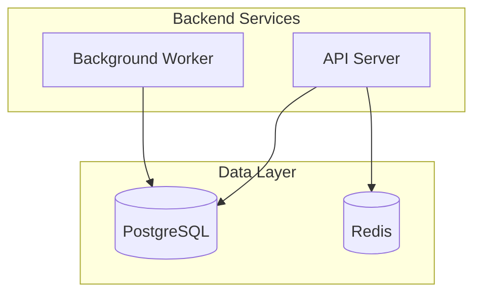

### Styling

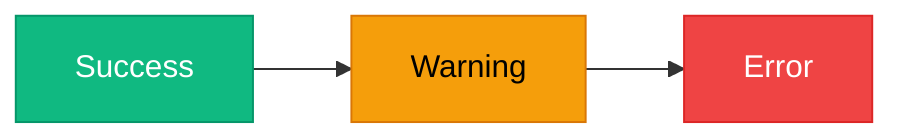

### Click Events

```
click A "https://example.com" "Tooltip text" _blank
click B callback "Tooltip"
```

---

## 2. Sequence Diagram

**Keyword:** `sequenceDiagram`

### Participant Types

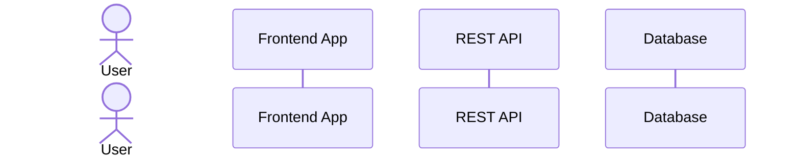

### Message Types

```
A->>B: Solid arrow (synchronous request)
A-->>B: Dotted arrow (asynchronous response)
A-)B: Open arrow (async message, fire-and-forget)
A--)B: Dotted open arrow (async response)
A-xB: Cross arrow (lost message)
A--xB: Dotted cross arrow
```

### Activation Boxes

```
A->>+B: Request    %% Activate B
B-->>-A: Response  %% Deactivate B
```

### Control Flow

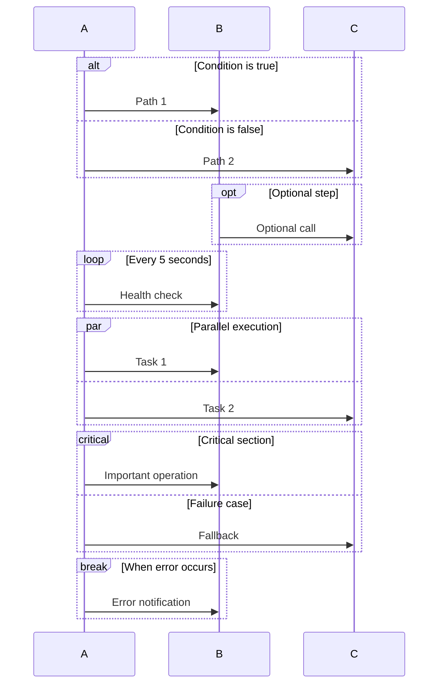

### Notes

```
Note right of A: Single participant note
Note over A,B: Note spanning participants
Note left of B: Left-side note
```

### Numbering

```
autonumber    %% Add at the top to auto-number messages
```

### Boxes (Grouping)

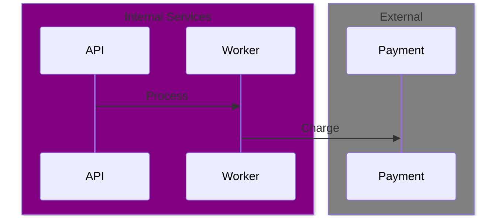

---

## 3. Class Diagram

**Keyword:** `classDiagram`

### Class Definition

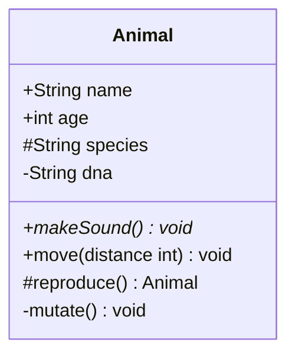

**Visibility modifiers:** `+` public, `-` private, `#` protected, `~` package

### Relationships

```
A <|-- B       %% Inheritance (B extends A)
A *-- B        %% Composition (A owns B, lifecycle bound)
A o-- B        %% Aggregation (A has B, independent lifecycle)
A --> B        %% Association (A uses B)
A ..> B        %% Dependency (A depends on B)
A ..|> B       %% Realization (B implements A)
A -- B         %% Link (solid)
A .. B         %% Link (dashed)
```

### Multiplicity

```
A "1" --> "*" B : has
A "1" --> "0..1" B : may have
A "0..*" --> "1..*" B : relates
```

### Annotations

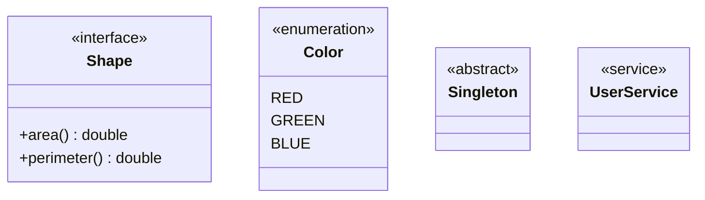

### Namespace

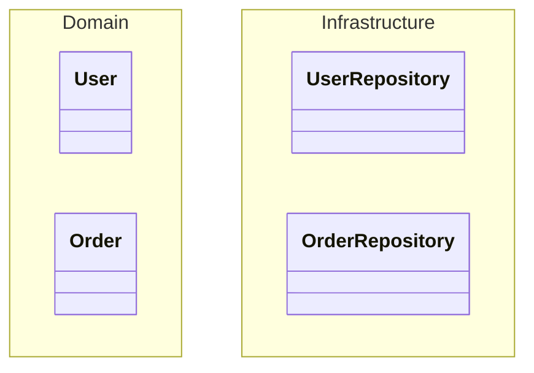

---

## 4. State Diagram

**Keyword:** `stateDiagram-v2`

### Basic Syntax

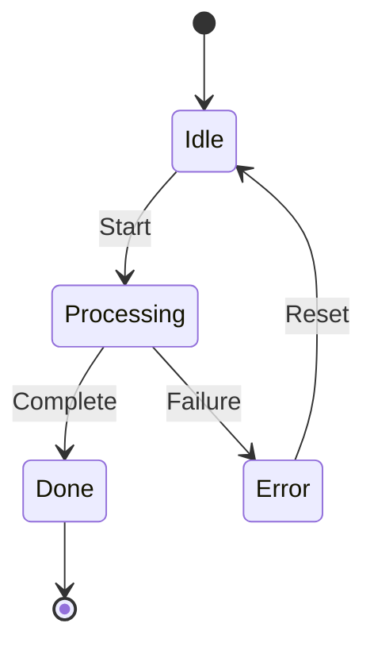

### Composite States

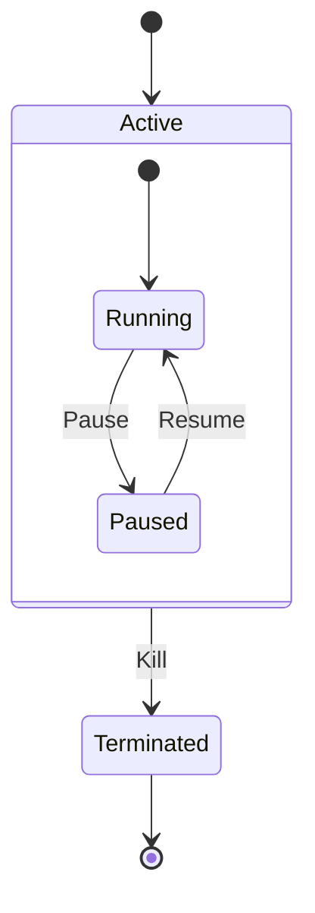

### Forks and Joins

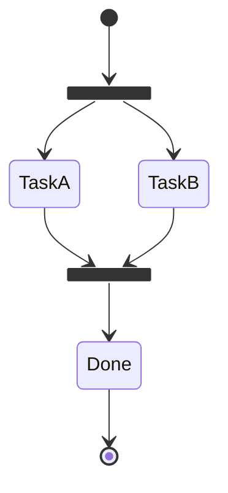

### Choice

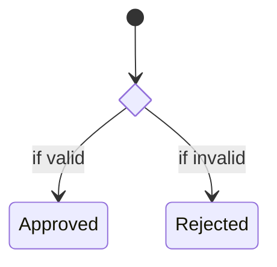

### Notes

```
note right of StateName
    Multi-line note
    explaining the state
end note
```

---

## 5. Entity Relationship Diagram

**Keyword:** `erDiagram`

### Relationship Types

```
A ||--|| B : "exactly one to exactly one"
A ||--o{ B : "one to zero or more"
A ||--|{ B : "one to one or more"
A }o--o{ B : "zero or more to zero or more"
A |o--o| B : "zero or one to zero or one"
```

### Cardinality Symbols

| Symbol | Meaning      |
| ------ | ------------ |
| `\|\|` | Exactly one  |
| `o\|`  | Zero or one  |
| `}o`   | Zero or more |
| `}\|`  | One or more  |

### Attribute Types

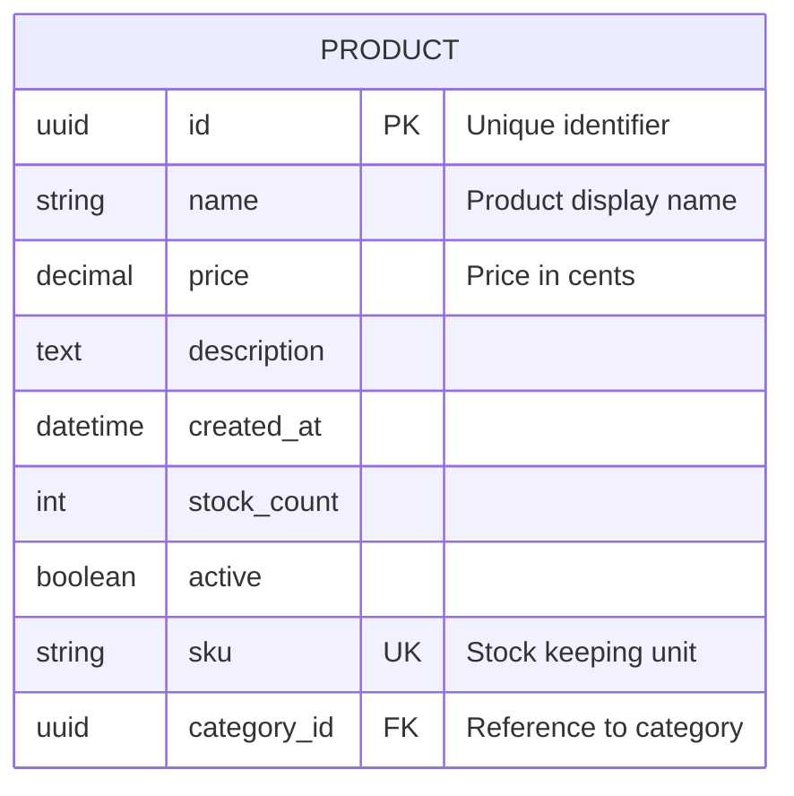

**Key markers:** `PK` (primary key), `FK` (foreign key), `UK` (unique key)

---

## 6. Gantt Chart

**Keyword:** `gantt`

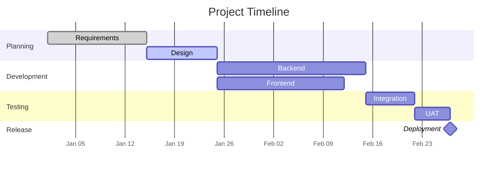

**Task states:** `done`, `active`, `crit` (critical path)
**Duration:** `7d` (days), `5h` (hours), or specific end date
**Dependencies:** `after taskId` or comma-separated `after task1 task2`

---

## 7. Pie Chart

**Keyword:** `pie`

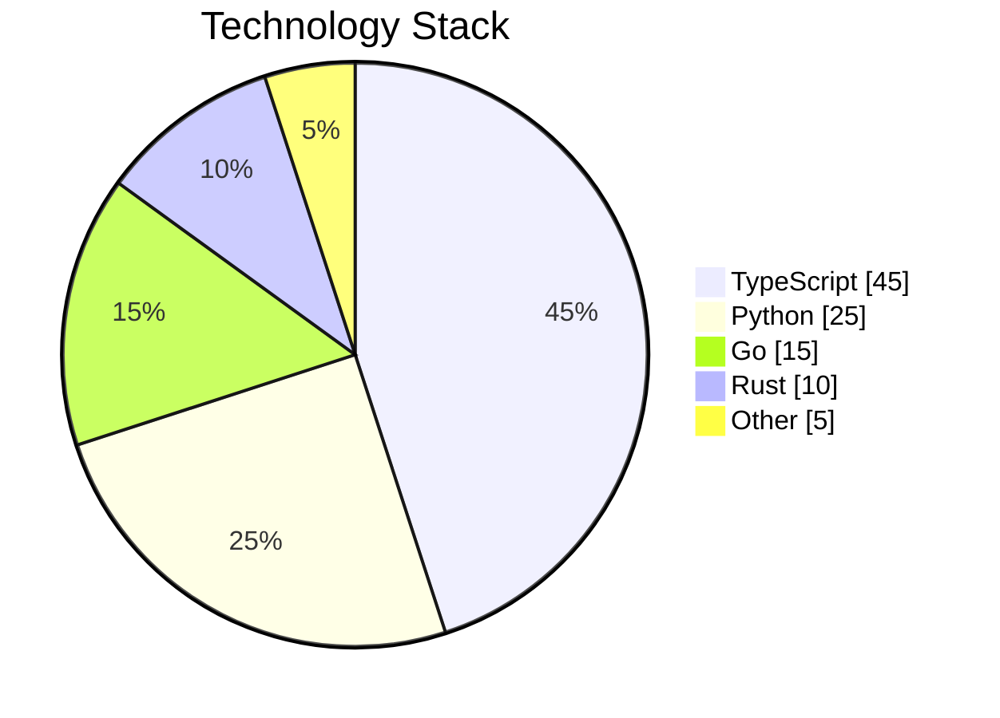

`showData` is optional — adds percentages to labels.

---

## 8. Mindmap

**Keyword:** `mindmap`

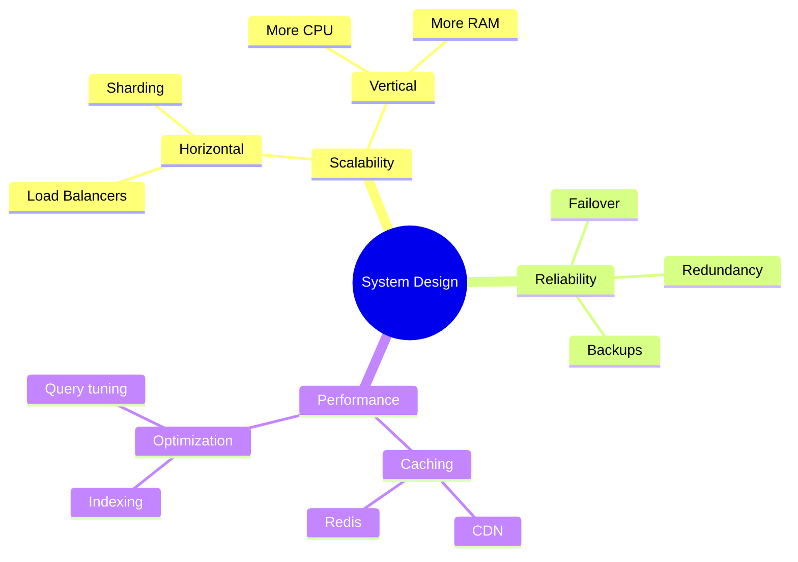

**Node shapes:**

- `((Circle))` — root/emphasis
- `(Rounded)` — default
- `[Square]` — structured
- `)Cloud(` — cloud shape
- `))Bang((` — explosion/emphasis

---

## 9. Timeline

**Keyword:** `timeline`

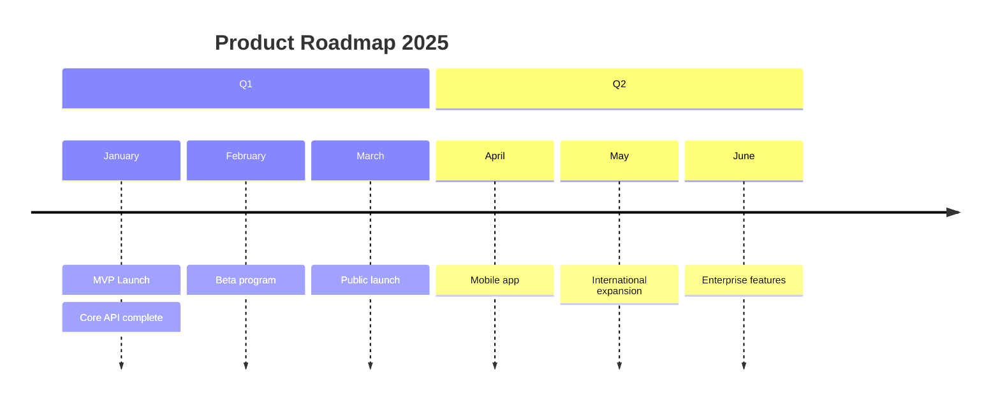

---

## 10. Git Graph

**Keyword:** `gitGraph`

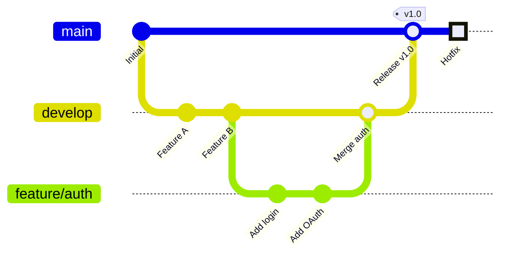

**Commit types:** `NORMAL`, `REVERSE`, `HIGHLIGHT`
**Options:** `branch order: 0` to control branch position

---

## 11. Sankey Diagram

**Keyword:** `sankey-beta`

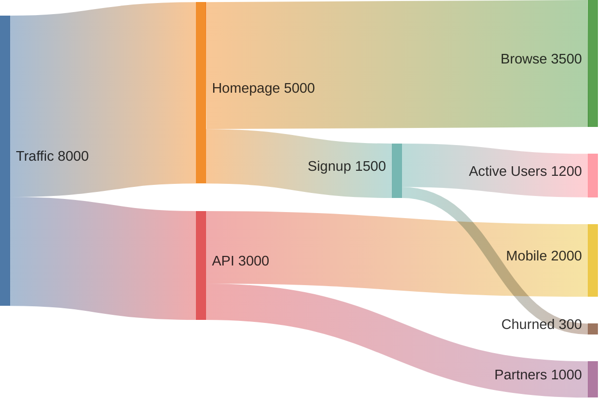

Format: `source,target,value` — one per line, comma-separated.

---

## 12. XY Chart

**Keyword:** `xychart-beta`

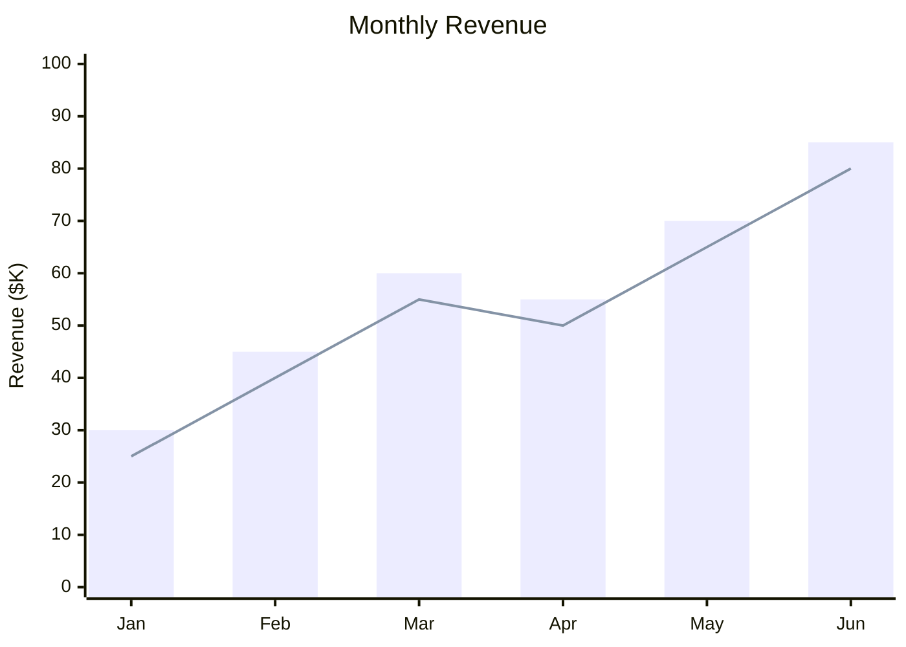

Supports `bar` and `line` series. Multiple series can be combined.

---

## 13. Quadrant Chart

**Keyword:** `quadrantChart`

```mermaid
quadrantChart
    title Feature Prioritization
    x-axis "Low Effort" --> "High Effort"
    y-axis "Low Impact" --> "High Impact"
    quadrant-1 "Quick Wins"
    quadrant-2 "Major Projects"
    quadrant-3 "Fill-ins"
    quadrant-4 "Thankless Tasks"
    Feature A: [0.8, 0.9]
    Feature B: [0.2, 0.7]
    Feature C: [0.6, 0.3]
    Feature D: [0.3, 0.2]
```

Coordinates are `[x, y]` with values between 0 and 1.

---

## 14. Block Diagram

**Keyword:** `block-beta`

```mermaid
block-beta
    columns 3

    space:1 Header["System Overview"]:1 space:1

    Frontend["React App"]:1 API["NestJS API"]:1 DB[("PostgreSQL")]:1

    Frontend --> API
    API --> DB
```

Use `columns N` to define grid. `space:N` for empty cells.
Blocks span cells with `:N` suffix.

---

## 15. User Journey

**Keyword:** `journey`

```mermaid
journey
    title User Checkout Experience
    section Browse
        Visit homepage: 5: Customer
        Search product: 4: Customer
        View details: 4: Customer
    section Purchase
        Add to cart: 5: Customer
        Enter payment: 2: Customer, Payment System
        Confirm order: 4: Customer, Order Service
    section Post-Purchase
        Receive confirmation: 5: Customer, Email Service
        Track delivery: 3: Customer
```

Format: `Task name: satisfaction(1-5): actor1, actor2`

---

## 16. Requirement Diagram

**Keyword:** `requirementDiagram`

```mermaid
requirementDiagram
    requirement high_availability {
        id: REQ-001
        text: System must achieve 99.9% uptime
        risk: high
        verifymethod: test
    }

    functionalRequirement auto_failover {
        id: REQ-002
        text: Automatic failover within 30 seconds
        risk: medium
        verifymethod: demonstration
    }

    element load_balancer {
        type: service
        docRef: arch-doc-001
    }

    high_availability - traces -> auto_failover
    auto_failover - satisfies -> load_balancer
```

**Relationship types:** `contains`, `copies`, `derives`, `satisfies`, `verifies`,
`refines`, `traces`

---

## 17. Packet Diagram

**Keyword:** `packet-beta`

```mermaid
packet-beta
    0-15: "Source Port"
    16-31: "Destination Port"
    32-63: "Sequence Number"
    64-95: "Acknowledgment Number"
    96-99: "Data Offset"
    100-105: "Reserved"
    106-111: "Flags"
    112-127: "Window Size"
    128-143: "Checksum"
    144-159: "Urgent Pointer"
```

Format: `start-end: "Label"` — bit ranges for protocol headers.

---

## 18. Kanban

**Keyword:** `kanban`

```mermaid
kanban
    column1["To Do"]
        task1["Design database schema"]
        task2["Write API specs"]
    column2["In Progress"]
        task3["Implement auth"]
    column3["Review"]
        task4["Code review: payments"]
    column4["Done"]
        task5["Setup CI/CD"]
```

---

## Global Configuration

Any diagram can be configured with frontmatter:

```mermaid
---
config:
  theme: base
  look: classic
  layout: dagre
  themeVariables:
    primaryColor: "#4f46e5"
    lineColor: "#94a3b8"
---
flowchart LR
    A --> B --> C
```

**Themes:** `default`, `forest`, `dark`, `neutral`, `base`
**Looks:** `classic`, `handDrawn`
**Layouts:** `dagre` (default), `elk` (advanced, needs integration)

## Directives (Inline Config)

**IMPORTANT:** The init directive MUST be on the very first line, before any diagram type declaration.

```
%%{init: {'theme': 'base', 'themeVariables': {
  'primaryColor': '#4f46e5', 'lineColor': '#94a3b8',
  'primaryTextColor': '#fff', 'primaryBorderColor': '#3730a3'
}}}%%
```

**Golden Rule:** Always include `'lineColor': '#94a3b8'` to replace the default harsh black lines with softer slate-colored lines. This single change dramatically improves diagram aesthetics.
