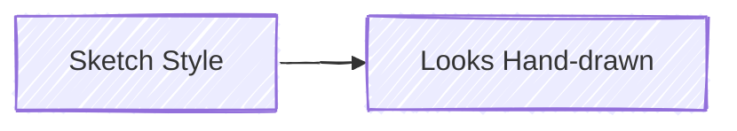

# Themes and Styling — Complete Reference

Load this file when the user requests custom themes, specific colors, or styled diagrams.

## Theme Sources

Two rendering engines provide different theme sets:

### Engine 1: @mermaid-js/mermaid-cli (mmdc)

5 built-in themes controlled via `--theme` flag or frontmatter:

| Theme     | Best for                                   |
| --------- | ------------------------------------------ |
| `default` | General use, light backgrounds             |
| `forest`  | Nature-inspired green tones, presentations |
| `dark`    | Dark backgrounds, dark-mode docs           |
| `neutral` | Minimal, grayscale, professional docs      |
| `base`    | Starting point for custom themes           |

### Engine 2: beautiful-mermaid

15 curated themes with consistent design:

**Light themes:**
| Theme | Style | Best for |
|-------|-------|----------|
| `zinc-light` | Clean gray tones | Professional documents |
| `tokyo-night-light` | Warm light | General use |
| `catppuccin-latte` | Soft pastels | Friendly docs |
| `nord-light` | Arctic cool tones | Technical docs |
| `github-light` | GitHub-style | READMEs, GitHub pages |
| `solarized-light` | Warm yellows | Long reading |

**Dark themes:**
| Theme | Style | Best for |
|-------|-------|----------|
| `zinc-dark` | Dark gray | Dark mode docs |
| `tokyo-night` | Vibrant dark | Developer tools |
| `tokyo-night-storm` | Deep blue-dark | Presentations |
| `catppuccin-mocha` | Rich dark | Dark mode, cozy feel |
| `nord` | Arctic dark | Technical, minimal |
| `dracula` | Purple-tinted dark | Developer-favorite |
| `github-dark` | GitHub dark mode | Dark READMEs |
| `solarized-dark` | Warm dark | Extended reading |
| `one-dark` | Atom-inspired | Code-adjacent docs |

### Theme Selection Guide

| Context                      | Recommended                              |
| ---------------------------- | ---------------------------------------- |
| GitHub/GitLab README         | `github-light` or `github-dark`          |
| Technical documentation      | `nord-light` or `neutral`                |
| Presentations (light room)   | `zinc-light` or `default`                |
| Presentations (dark room)    | `tokyo-night-storm` or `dracula`         |
| Developer tools / terminal   | `tokyo-night` or `one-dark`              |
| Client-facing / professional | `zinc-light` or `neutral`                |
| Personal blog / casual       | `catppuccin-latte` or `catppuccin-mocha` |

## Custom Theming (mermaid-cli)

When using the `base` theme, you can override any variable:

### Via Frontmatter


### Via Init Directive

```
%%{init: {'theme': 'base', 'themeVariables': {
  'primaryColor': '#4f46e5',
  'primaryTextColor': '#fff',
  'primaryBorderColor': '#3730a3',
  'lineColor': '#6b7280',
  'secondaryColor': '#10b981',
  'tertiaryColor': '#f59e0b'
}}}%%
```

### Via Render Script Config

```bash
node $SKILL_DIR/scripts/render.mjs \
  --input diagram.mmd \
  --output diagram.svg \
  --format svg \
  --theme base \
  --config '{"theme":"base","themeVariables":{"primaryColor":"#4f46e5"}}'
```

## Available Theme Variables

### Core Colors

| Variable             | Controls                         |
| -------------------- | -------------------------------- |
| `primaryColor`       | Main node fill color             |
| `primaryTextColor`   | Text on primary-colored elements |
| `primaryBorderColor` | Border of primary elements       |
| `secondaryColor`     | Secondary elements, alternates   |
| `tertiaryColor`      | Tertiary elements, highlights    |
| `lineColor`          | Edge/connection lines            |
| `background`         | Diagram background               |
| `mainBkg`            | Default node background          |
| `nodeBorder`         | Default node border              |

### Text

| Variable              | Controls                      |
| --------------------- | ----------------------------- |
| `titleColor`          | Diagram title text            |
| `textColor`           | General text                  |
| `edgeLabelBackground` | Background behind edge labels |

### Clusters / Subgraphs

| Variable        | Controls                  |
| --------------- | ------------------------- |
| `clusterBkg`    | Subgraph/group background |
| `clusterBorder` | Subgraph/group border     |

### Sequence Diagram Specific

| Variable                | Controls                      |
| ----------------------- | ----------------------------- |
| `actorBkg`              | Participant box fill          |
| `actorBorder`           | Participant box border        |
| `actorTextColor`        | Participant text              |
| `activationBkgColor`    | Activation box fill           |
| `activationBorderColor` | Activation box border         |
| `signalColor`           | Message arrow color           |
| `signalTextColor`       | Message text color            |
| `noteBkgColor`          | Note background               |
| `noteBorderColor`       | Note border                   |
| `noteTextColor`         | Note text                     |
| `labelBoxBkgColor`      | Alt/loop/opt label background |
| `labelBoxBorderColor`   | Alt/loop/opt label border     |
| `loopTextColor`         | Loop label text               |

### Flowchart Specific

| Variable        | Controls  |
| --------------- | --------- |
| `nodeTextColor` | Node text |

## Element-Level Styling

### CSS Classes (Flowchart)


### Inline Styles (Flowchart)


### Link Styles (Flowchart)


## Brand Color Presets

### Tailwind-Inspired Palette

```
%%{init: {'theme': 'base', 'themeVariables': {
  'primaryColor': '#3b82f6',
  'primaryTextColor': '#ffffff',
  'primaryBorderColor': '#2563eb',
  'secondaryColor': '#10b981',
  'tertiaryColor': '#f59e0b',
  'lineColor': '#6b7280',
  'background': '#ffffff',
  'mainBkg': '#f8fafc',
  'nodeBorder': '#e2e8f0',
  'clusterBkg': '#f1f5f9',
  'clusterBorder': '#cbd5e1'
}}}%%
```

### AWS-Themed

```
%%{init: {'theme': 'base', 'themeVariables': {
  'primaryColor': '#FF9900',
  'primaryTextColor': '#232F3E',
  'primaryBorderColor': '#232F3E',
  'secondaryColor': '#527FFF',
  'tertiaryColor': '#DD344C',
  'lineColor': '#232F3E',
  'background': '#ffffff',
  'mainBkg': '#F2F3F3',
  'nodeBorder': '#232F3E',
  'clusterBkg': '#F2F3F3',
  'clusterBorder': '#232F3E'
}}}%%
```

### Monochrome Professional

```
%%{init: {'theme': 'base', 'themeVariables': {
  'primaryColor': '#374151',
  'primaryTextColor': '#ffffff',
  'primaryBorderColor': '#1f2937',
  'secondaryColor': '#6b7280',
  'tertiaryColor': '#9ca3af',
  'lineColor': '#4b5563',
  'background': '#ffffff',
  'mainBkg': '#f9fafb',
  'nodeBorder': '#d1d5db',
  'clusterBkg': '#f3f4f6',
  'clusterBorder': '#9ca3af'
}}}%%
```

## Look Options



| Look        | Effect                             |
| ----------- | ---------------------------------- |
| `classic`   | Standard clean rendering (default) |
| `handDrawn` | Sketch-like, informal appearance   |

## Configuration via Frontmatter

Full example combining theme, look, and layout:


**Layout engines:**
| Engine | When to use |
|--------|-------------|
| `dagre` | Default — good for most diagrams |
| `elk` | Complex diagrams with many crossings (requires plugin) |
