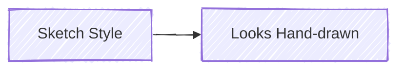
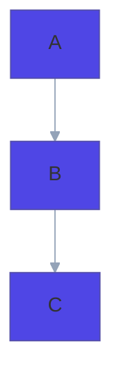

# Themes and Styling — Complete Reference

Load this file when the user requests custom themes, specific colors, or styled diagrams.

## Theme Sources

Two rendering engines provide different theme sets:

### Engine 1: @mermaid-js/mermaid-cli (mmdc)

5 built-in themes controlled via `--theme` flag or frontmatter:

| Theme     | Best for                                   |
| --------- | ------------------------------------------ |
| `default` | General use, light backgrounds             |
| `forest`  | Nature-inspired green tones, presentations |
| `dark`    | Dark backgrounds, dark-mode docs           |
| `neutral` | Minimal, grayscale, professional docs      |
| `base`    | Starting point for custom themes           |

### Engine 2: beautiful-mermaid

15 curated themes with consistent design:

**Light themes:**
| Theme | Style | Best for |
|-------|-------|----------|
| `zinc-light` | Clean gray tones | Professional documents |
| `tokyo-night-light` | Warm light | General use |
| `catppuccin-latte` | Soft pastels | Friendly docs |
| `nord-light` | Arctic cool tones | Technical docs |
| `github-light` | GitHub-style | READMEs, GitHub pages |
| `solarized-light` | Warm yellows | Long reading |

**Dark themes:**
| Theme | Style | Best for |
|-------|-------|----------|
| `zinc-dark` | Dark gray | Dark mode docs |
| `tokyo-night` | Vibrant dark | Developer tools |
| `tokyo-night-storm` | Deep blue-dark | Presentations |
| `catppuccin-mocha` | Rich dark | Dark mode, cozy feel |
| `nord` | Arctic dark | Technical, minimal |
| `dracula` | Purple-tinted dark | Developer-favorite |
| `github-dark` | GitHub dark mode | Dark READMEs |
| `solarized-dark` | Warm dark | Extended reading |
| `one-dark` | Atom-inspired | Code-adjacent docs |

### Theme Selection Guide

| Context                      | Recommended                              |
| ---------------------------- | ---------------------------------------- |
| GitHub/GitLab README         | `github-light` or `github-dark`          |
| Technical documentation      | `nord-light` or `neutral`                |
| Presentations (light room)   | `zinc-light` or `default`                |
| Presentations (dark room)    | `tokyo-night-storm` or `dracula`         |
| Developer tools / terminal   | `tokyo-night` or `one-dark`              |
| Client-facing / professional | `zinc-light` or `neutral`                |
| Personal blog / casual       | `catppuccin-latte` or `catppuccin-mocha` |

## Custom Theming (mermaid-cli)

When using the `base` theme, you can override any variable:

### Via Frontmatter


### Via Init Directive

```
%%{init: {'theme': 'base', 'themeVariables': {
  'primaryColor': '#4f46e5',
  'primaryTextColor': '#fff',
  'primaryBorderColor': '#3730a3',
  'lineColor': '#6b7280',
  'secondaryColor': '#10b981',
  'tertiaryColor': '#f59e0b'
}}}%%
```

### Via Render Script Config

```bash
node $SKILL_DIR/scripts/render.mjs \
  --input diagram.mmd \
  --output diagram.svg \
  --format svg \
  --theme base \
  --config '{"theme":"base","themeVariables":{"primaryColor":"#4f46e5"}}'
```

## Available Theme Variables

### Core Colors

| Variable             | Controls                         |
| -------------------- | -------------------------------- |
| `primaryColor`       | Main node fill color             |
| `primaryTextColor`   | Text on primary-colored elements |
| `primaryBorderColor` | Border of primary elements       |
| `secondaryColor`     | Secondary elements, alternates   |
| `tertiaryColor`      | Tertiary elements, highlights    |
| `lineColor`          | Edge/connection lines            |
| `background`         | Diagram background               |
| `mainBkg`            | Default node background          |
| `nodeBorder`         | Default node border              |

### Text

| Variable              | Controls                      |
| --------------------- | ----------------------------- |
| `titleColor`          | Diagram title text            |
| `textColor`           | General text                  |
| `edgeLabelBackground` | Background behind edge labels |

### Clusters / Subgraphs

| Variable        | Controls                  |
| --------------- | ------------------------- |
| `clusterBkg`    | Subgraph/group background |
| `clusterBorder` | Subgraph/group border     |

### Sequence Diagram Specific

| Variable                | Controls                      |
| ----------------------- | ----------------------------- |
| `actorBkg`              | Participant box fill          |
| `actorBorder`           | Participant box border        |
| `actorTextColor`        | Participant text              |
| `activationBkgColor`    | Activation box fill           |
| `activationBorderColor` | Activation box border         |
| `signalColor`           | Message arrow color           |
| `signalTextColor`       | Message text color            |
| `noteBkgColor`          | Note background               |
| `noteBorderColor`       | Note border                   |
| `noteTextColor`         | Note text                     |
| `labelBoxBkgColor`      | Alt/loop/opt label background |
| `labelBoxBorderColor`   | Alt/loop/opt label border     |
| `loopTextColor`         | Loop label text               |

### Flowchart Specific

| Variable        | Controls  |
| --------------- | --------- |
| `nodeTextColor` | Node text |

## Element-Level Styling

### CSS Classes (Flowchart)


### Inline Styles (Flowchart)


### Link Styles (Flowchart)


## Brand Color Presets

### Tailwind-Inspired Palette

```
%%{init: {'theme': 'base', 'themeVariables': {
  'primaryColor': '#3b82f6',
  'primaryTextColor': '#ffffff',
  'primaryBorderColor': '#2563eb',
  'secondaryColor': '#10b981',
  'tertiaryColor': '#f59e0b',
  'lineColor': '#6b7280',
  'background': '#ffffff',
  'mainBkg': '#f8fafc',
  'nodeBorder': '#e2e8f0',
  'clusterBkg': '#f1f5f9',
  'clusterBorder': '#cbd5e1'
}}}%%
```

### AWS-Themed (Elegant)

Uses AWS orange for primary with **soft slate lines** instead of the harsh default black:

```
%%{init: {'theme': 'base', 'themeVariables': {
  'primaryColor': '#FF9900',
  'primaryTextColor': '#232F3E',
  'primaryBorderColor': '#c47600',
  'secondaryColor': '#527FFF',
  'tertiaryColor': '#DD344C',
  'lineColor': '#94a3b8',
  'background': '#ffffff',
  'mainBkg': '#FFF8F0',
  'nodeBorder': '#c47600',
  'clusterBkg': '#FFF8F0',
  'clusterBorder': '#d4a574',
  'edgeLabelBackground': '#ffffff'
}}}%%
```

### Monochrome Professional

```
%%{init: {'theme': 'base', 'themeVariables': {
  'primaryColor': '#374151',
  'primaryTextColor': '#ffffff',
  'primaryBorderColor': '#1f2937',
  'secondaryColor': '#6b7280',
  'tertiaryColor': '#9ca3af',
  'lineColor': '#94a3b8',
  'background': '#ffffff',
  'mainBkg': '#f9fafb',
  'nodeBorder': '#d1d5db',
  'clusterBkg': '#f3f4f6',
  'clusterBorder': '#9ca3af',
  'edgeLabelBackground': '#ffffff'
}}}%%
```

### Indigo-Emerald (Modern SaaS)

A fresh, modern palette for SaaS architecture diagrams:

```
%%{init: {'theme': 'base', 'themeVariables': {
  'primaryColor': '#4f46e5',
  'primaryTextColor': '#ffffff',
  'primaryBorderColor': '#3730a3',
  'secondaryColor': '#10b981',
  'tertiaryColor': '#f59e0b',
  'lineColor': '#94a3b8',
  'background': '#ffffff',
  'mainBkg': '#f8fafc',
  'nodeBorder': '#cbd5e1',
  'clusterBkg': '#f1f5f9',
  'clusterBorder': '#e2e8f0',
  'titleColor': '#1e293b',
  'edgeLabelBackground': '#ffffff',
  'textColor': '#334155'
}}}%%
```

## C4 Diagram Styling

C4 diagrams have fixed element colors (blue for systems, gray for persons, etc.) but the **relationship lines default to harsh black**. Always override them.

**CRITICAL — Arrow Spaghetti Prevention:**

The #1 cause of messy C4 diagrams is too many `Rel()` relationships. Mermaid's Dagre layout engine routes ALL arrows, and with more than ~6 relationships, they inevitably cross and overlap. Follow these rules:

- **Maximum 6 Rel() per diagram** — if you need more, split into multiple diagrams
- **Tree-shaped topology** — each node should ideally have 1 incoming and 1-2 outgoing edges
- **Avoid mesh connections** — don't connect everything to everything
- **Declare elements in flow order** — top-to-bottom or left-to-right; the order of declaration affects layout

### Soft Lines (Mandatory for All C4)

```
    %% Apply to EVERY Rel() in the diagram
    UpdateRelStyle(from, to, $textColor="#475569", $lineColor="#94a3b8")
    UpdateLayoutConfig($c4ShapeInRow="3", $c4BoundaryInRow="1")
```

### Highlighted Paths in C4

Use accent colors for primary flows while keeping secondary lines soft:

```
    %% Primary/user-facing relationship
    UpdateRelStyle(user, api, $textColor="#1e40af", $lineColor="#3b82f6")

    %% Internal relationship
    UpdateRelStyle(api, db, $textColor="#475569", $lineColor="#94a3b8")

    %% External/risky connection
    UpdateRelStyle(api, external, $textColor="#92400e", $lineColor="#f59e0b")
```

### Custom Element Colors in C4

```
    UpdateElementStyle(elementAlias, $bgColor="#4f46e5", $fontColor="#ffffff", $borderColor="#3730a3")
```

| Purpose              | bgColor   | fontColor | borderColor |
| -------------------- | --------- | --------- | ----------- |
| Primary emphasis     | `#4f46e5` | `#ffffff` | `#3730a3`   |
| Success / Data store | `#059669` | `#ffffff` | `#047857`   |
| Warning / External   | `#d97706` | `#ffffff` | `#b45309`   |
| Neutral / Supporting | `#64748b` | `#ffffff` | `#475569`   |

## Look Options



| Look        | Effect                             |
| ----------- | ---------------------------------- |
| `classic`   | Standard clean rendering (default) |
| `handDrawn` | Sketch-like, informal appearance   |

## Configuration via Frontmatter

Full example combining theme, look, and layout:



**Layout engines:**
| Engine | When to use |
|--------|-------------|
| `dagre` | Default — good for most diagrams |
| `elk` | Complex diagrams with many crossings (requires plugin) |

## Modern Design Principles

### The Golden Rule: Soft Lines

The single biggest improvement to any Mermaid diagram is replacing the default black lines with a softer color. **Always use `lineColor: '#94a3b8'`** (Slate-400) for light backgrounds or `lineColor: '#64748b'` (Slate-500) for dark themes.

### Color Harmony

Use max 3-4 colors per diagram and map them to meaning:

- **Blue tones** → internal systems, primary services
- **Green tones** → data stores, success states
- **Amber tones** → external systems, warnings
- **Slate tones** → lines, borders, secondary elements
- **Red tones** → error states ONLY (never decoration)

### Typography and Labels

- Keep labels short (max 3-4 words)
- Use `<br/>` for multi-line labels when needed
- Use natural language, not abbreviations
- Include protocol/technology in relationship labels

**CRITICAL — Font Compatibility:**

Do NOT use `system-ui`, `-apple-system`, or `Segoe UI` in `fontFamily` theme variables. These fonts are not available in headless Chromium (used by `mmdc` for rendering) and will silently fall back to a serif font like Times New Roman, making the diagram look unprofessional.

**Safe font stacks for `fontFamily`:**
- Default (best): `'trebuchet ms', 'verdana', 'arial', sans-serif` — this is Mermaid's built-in default and works everywhere
- If you must customize: `'verdana', 'arial', 'helvetica', sans-serif`

In practice, do NOT set `fontFamily` at all unless you have a specific reason. The Mermaid default font is already professional and universally compatible.

### Density and Whitespace

- Max 15 nodes per diagram
- Use subgraphs to create visual grouping and whitespace
- Use invisible links (`A ~~~ B`) to add spacing when needed
- Prefer LR over TD for most diagrams (reads more naturally)

### Init Directive Override Behavior

When using the render script, the `--theme` flag writes a config file passed to `mmdc -c`. If your `.mmd` file contains a `%%{init}%%` directive, the render script automatically detects it and does NOT pass a theme in the config, so your init directive takes full precedence. This means:

- If your `.mmd` has `%%{init: {'theme': 'dark', ...}}%%`, it will render with dark theme correctly
- If your `.mmd` has NO init directive, the render script's `--theme` flag (default: `default`) will be applied
- You do NOT need to pass `--theme` when using init directives
